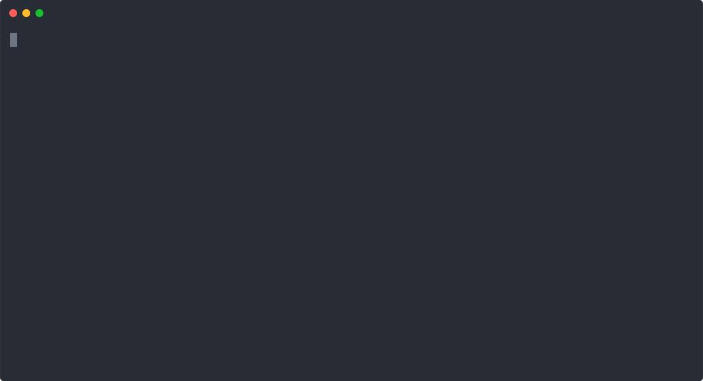

<p  align="center">  </p>
<h1 align="center">Samurai</h1>
<h4 align="center">"The Readable Password Generator"</h4>

<p align="center">
    <a href="https://travis-ci.com/github/wollemat/samurai/builds">
    
    <a href="LICENSE.md">
    
    <a href="https://paypal.me/wollemat">
    
</p>
      
<p align="center">
  <a href="#about">About</a> •
  <a href="#building">Building</a> •
  <a href="#deployment">Deployment</a> •
  <a href="#examples">Examples</a> •
  <a href="#contributing">Contributing</a> •
  <a href="#contributors">Contributors</a> •
  <a href="#donate">Donate</a> •
  <a href="#license">License</a>
</p>

## About

**Samurai** is a simple password generator for the command line. 
**Simple** is the magic word, the source is elegant and clean but additionally the generated passwords are human readable, pronounceable and easily typed. 
Most of the benefits of a long and strong password with less of the drawbacks.

This project came into being because anyone "lazy" or "responsible" uses a password manager these days. 
They are a gift from the heavens if you ask me. 
You can use unique and strong passwords for each and everyone of your accounts. 
You dont have to remember them anyways. 
Still, I found myself in the situation occasionally that manually typing a password was necessary and this can be a pain in the ass when the password is something like `dcHwggxykM?mpJ@jht87g#=VLGN2Yv`. 
The solution is Samurai, it generates passwords arbitrarily long, strong and complicated while still being moderately pronounceable, writable and memorable. 
QUICK DISCLAIMER: I am not a security expert of any kind. 
Please do not accept my advise without a grain of salt (get it!). 
Use your own brain and if you do not agree with this method then use any other method you do agree with.

<p align="center">  </p>

## Building

Before building Samurai please make sure that the following tools are up and running on your machine:

* A working installment of GCC
* A working installment of CMake
* A working installment of Make

Download the source code by running the following code in your command prompt:

```
$ git clone https://github.com/wollemat/samurai.git
```

Or simply grab a copy of the source code as a zip file [here](https://github.com/wollemat/samurai/archive/master.zip) for the latest release and [here](https://github.com/wollemat/samurai/archive/develop.zip) for the *"bleeding edge"* version.

Building is as simple as running the following commands in the root of the project:

```
$ mkdir build
$ cd build
$ cmake ..
$ make
```

This will create a `build` directory in which CMake and Make will run.
If done correctly a directory called `bin` is created in the root of the project. 
The executable binary `samurai` is placed inside the this `bin` folder.

## Deployment

Running Samurai is just as easy as building it. 
You can directly run the executable in the `build` directory or add the binary to your `PATH` and run it like any other program. 
Now, you can simply run `samurai` and receive your newly generated passwords.

Some default settings are used to generate some decent passwords. 
However, behaviour can be altered using a variety of flags:

| Flag          | Argument | Default | Description                                 |
|---------------|----------|---------|---------------------------------------------|
| --version     | none     | none    | Display the current version of Samurai.     |
| --help        | none     | none    | Show a usage manual message.                |
| --copy        | none     | none    | Copy to the clipboard instead of printing.  |
| --length      | int      | 12      | Set the character length of password.       |
| --numbered    | int      | 0       | Set the digit length of the number suffix.  |
| --capitalised | none     | false   | Capitalise the password.                    |
| --specialised | none     | false   | End password with special character.        |

## Examples

Some examples for you to get you on your way. 
Use them as inspiration and obviously DO NOT use these passwords yourselves.

```
$ samurai
```

```
$ samurai --version
```

```
$ samurai --help
```

```
$ samurai --copy
```

```
$ samurai --length 20
```

```
$ samurai --numbered 3
```

```
$ samurai --capitalised
```

```
$ samurai --specialised
```

Good Luck & Be Safe!

## Contributing

Feel free to help me out and make your mark on this project. 
No program is ever perfect and Samurai can always be improved upon.
If you feel like a feature is missing or you encounter a bug, please report it by creating an [issue](https://github.com/wollemat/samurai/issues/new).
Before doing this please read the [Code of Conduct](CODE_OF_CONDUCT.md) and the [Contributing Guidelines](CONTRIBUTING.md).
I look forward to working with you.

## Contributors

* **Frederik Christian Slothouber** - *Initial work* - [wollemat](https://github.com/wollemat)
* **Fabian Mastenbroek** - *Random number generation* - [fabianishere](https://github.com/fabianishere)

## Donate

Please consider [donating](https://paypal.me/wollemat) if you found Samurai helpful in any shape or form. 
A small contribution comes a long way and is much appreciated.

## License

<p align="center">This project and its code are released under the MIT license. Please have a look at the <a href="LICENSE.md">LICENSE.md</a> for more details.</p>
<p align="center">Icon made by <a href="https://www.flaticon.com/authors/monkik">monkik</a> from www.flaticon.com</p>
<p align="center">copyright © <a href="https://github.com/wollemat">wollemat</a></p>
